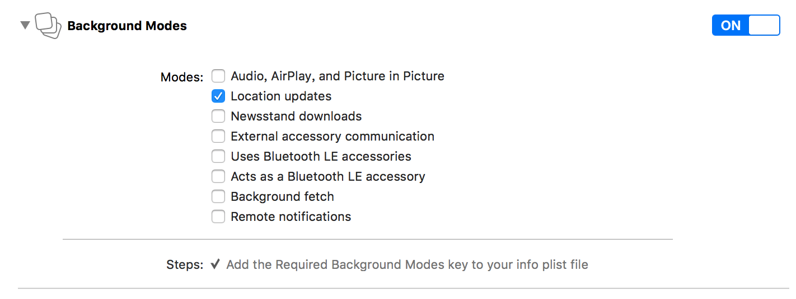

# CityNameOfCoreLocation
## 各系统版本的前台跟后台访问权限
* ### iOS 8 之前
    如果想要定位需要在plist文件中添加 Key Privacy - Location Usage Description(NSLocationUsageDescription)，默认只在前台定位，如果想开启后台定位需要在开启后台模式中设置
        
* ### iOS 8+
    iOS 8.0开始，苹果进一步加强了对用户隐私的保护。当App想访问用户的隐私信息时，系统不再自动弹出一个对话框让用户授权。我们需要调用iOS 8.0的API,主动请求用户授权
    * #### requestAlwaysAuthorization           //请求允许在前后台获取用户位置授权
    * #### requestWhenInUseAuthorization    //请求允许在前台获取用户位置授权
    注意：务必在 info.plist 文件中配置对应的键值，否则以上请求授权的方法不生效
    * #### NSLocationAlwaysUsageDescription： 允许在前后台获取位置信息
    * #### NSLocationWhenInUseDescription: 允许在前台获取位置信息
    
    注意：如果是前台定位权限，但是开启了后台模式，在后台也是可以定位的，但是屏幕的上边会有蓝条，提示用户是哪个应用在定位（膜拜单车）
    
* ### iOS 9
    如果想要在后台定位，除了配置NSLocationAlwaysUsageDescription(前后台定位)外，还需要手动设置`allowsBackgroundLocationUpdates = YES`,否则后台不会定位
## 定位功能的实现
* ### 导入框架
        Xcode 中添加 “CoreLocation.framework”
* ### 导入头文件
        #import <CoreLocation/CoreLocation.h>
* ### 声明管理器和代理
        @interface ViewController ()<CLLocationManagerDelegate>
        @property (nonatomic, strong) CLLocationManager* locationManager;
        @end
* ### 初始化管理器
        self.locationManager = [[CLLocationManager alloc] init];
        self.locationManager.delegate = self;
        self.locationManager.desiredAccuracy = kCLLocationAccuracyBest;
* ### 开启定位服务，需要定位时调用findMe方法
        - (void)findMe
        {
        /** 由于IOS8中定位的授权机制改变 需要进行手动授权
        * 获取授权认证，两个方法：
        * [self.locationManager requestWhenInUseAuthorization];
        * [self.locationManager requestAlwaysAuthorization];
        */
        if ([self.locationManager respondsToSelector:@selector(requestAlwaysAuthorization)]) {
        NSLog(@"requestAlwaysAuthorization");
        [self.locationManager requestAlwaysAuthorization];
        }

        //开始定位，不断调用其代理方法
        [self.locationManager startUpdatingLocation];
        NSLog(@"start gps");
        }
* ### 代理设置
        - (void)locationManager:(CLLocationManager *)manager
        didUpdateLocations:(NSArray *)locations
        {
        // 1.获取用户位置的对象
        CLLocation *location = [locations lastObject];
        CLLocationCoordinate2D coordinate = location.coordinate;
        NSLog(@"纬度:%f 经度:%f", coordinate.latitude, coordinate.longitude);

        // 2.停止定位
        [manager stopUpdatingLocation];
        }

        - (void)locationManager:(CLLocationManager *)manager
        didFailWithError:(NSError *)error
        {
        if (error.code == kCLErrorDenied) {
        // 提示用户出错原因，可按住Option键点击 KCLErrorDenied的查看更多出错信息，可打印error.code值查找原因所在
        }
        }
    
## 其他(参考文章)
* [Markdown在线编译器](http://mahua.jser.me/)
* [iOS CLLocationManager定位](http://www.jianshu.com/p/c4db2cb0fa93)
* [iOS 定位功能的实现](http://www.jianshu.com/p/f58be9373b6a)

## 备注
练习readme的编写

